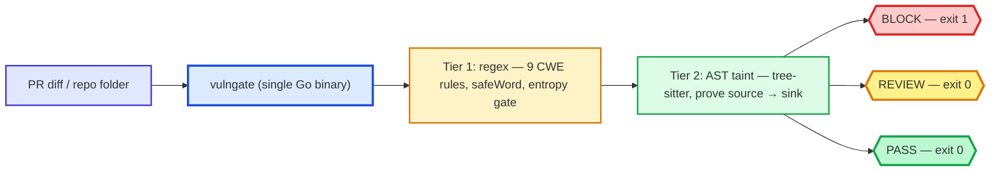

# Excalidraw diagram prompts

Hand-drawn, Excalidraw-style architecture diagram of VulnGate. Three ways to
regenerate it, easiest first.

## 1. Paste into Excalidraw (fastest)

Open [excalidraw.com](https://excalidraw.com), press Cmd+K, choose
"Text to Diagram", paste:



Or import the ready-made scene: [`vulngate_arch.excalidraw`](vulngate_arch.excalidraw)
(excalidraw.com → Menu → Open).

## 2. Style prompt for AI image generators

Paste into any image model:

> A clean technical architecture diagram drawn in the Excalidraw hand-drawn
> style: sketchy uneven pencil strokes, marker hand-lettering in a casual
> handwriting font, on a warm cream paper background. On the left a rounded
> rectangle labeled "PR diff / repo folder" in indigo. Center: a large blue
> hatched rounded container titled "vulngate (Go binary)" containing two
> smaller sketchy boxes, an amber cross-hatched box "Tier 1: regex — 9 CWE
> rules, safeWord, entropy" and a green zigzag-filled box "Tier 2: AST taint —
> tree-sitter, prove source→sink". Three wobbly arrows lead to three
> hand-drawn ovals in traffic-light colors: red "BLOCK — exit 1", yellow
> "REVIEW — exit 0", green "PASS — exit 0". Small handwritten footer text:
> "48ms · F1 1.00 · offline · SARIF + JSON" and in red "any HIGH → merge
> mechanically blocked". Flat, no shadows, no gradients, joyful but precise.
> 16:9.

For exec slides, drop the two middle tier boxes and keep input → gate →
three verdicts.

## 3. Re-render the exact PNG from source

[`diagram-render.html`](diagram-render.html) draws the same scene with
rough.js. Render at retina scale with any headless Chromium:

```
open in browser at 1200x675, wait for the Caveat font, screenshot
```

The pre-rendered output is 2400x1350 PNG (retina), currently in use for the
Substack article visuals.
